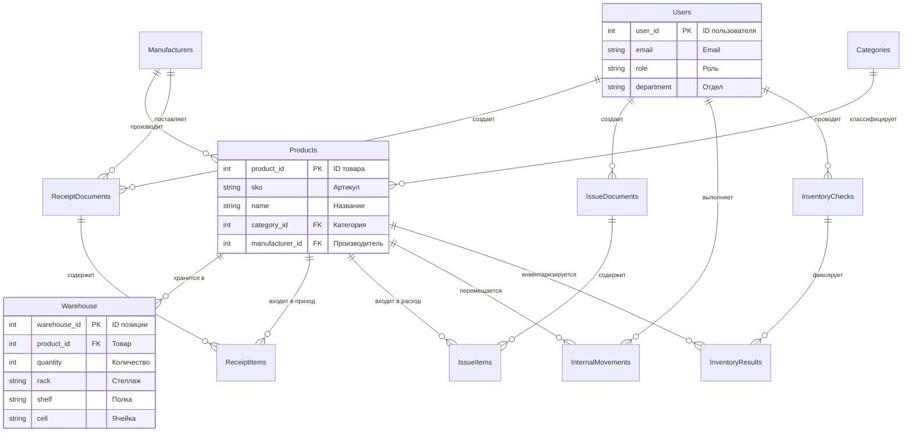

## 🏭 Автоматизированная система складского учёта (АСУ Склад)

**Разработчик:** Чуляков Семён Игоревич  
**Группа:** 11/2-РПО-24/2  
**Дата актуализации:** 13.12.2025

---

## 📋 О проекте

Курсовой проект по дисциплине **«Проектирование информационных систем»**.  
**Цель** — автоматизация полного цикла складских операций современного предприятия для ликвидации бумажного учёта, сокращения ошибок и повышения операционной эффективности.

**Ключевые цели:**
- Сокращение времени на поиск товаров на складе на **60%**
- Уменьшение ошибок при инвентаризации на **90%**
- Повышение точности учёта товарно-материальных ценностей до **99,5%**

## 🏗️ Архитектура системы

### 3.1. Общая архитектурная схема
Система строится на основе **многоуровневой (N-слойной) архитектуры**:
1. **Уровень представления (Presentation):** Веб-интерфейс (React) и/или мобильное приложение
2. **Уровень бизнес-логики (Business Logic):** Серверное приложение (ASP.NET Core Web API), реализующее все операции склада
3. **Уровень данных (Data Access):** Репозитории и ORM (Entity Framework Core) для работы с БД
4. **Уровень хранения данных (Data Storage):** Реляционная база данных **Microsoft SQL Server**

**Выбор монолитной (многоуровневой) архитектуры** для учебного проекта обоснован:
- **Простота разработки и развёртывания**
- **Целостность данных и транзакций** (операции приёмки/списания должны быть атомарными)
- **Полный контроль над всеми компонентами системы**

### 3.2. Схема базы данных
Основу системы составляет реляционная БД, спроектированная в **Microsoft SQL Server**.

**Ключевые сущности:**
- **Пользователи** – Учётные записи системы (Администратор, Менеджер, Кладовщик, Аудитор)
- **Товары** – Номенклатура товаров и материалов
- **Складские остатки** – Остатки товаров с привязкой к ячейкам хранения
- **Приходные/Расходные документы** – Документы движения товаров
- **Инвентаризации** – Планы и результаты проверок остатков

Полное описание структуры БД: [`database/Описание таблиц.md`](./database/Описание%20таблиц.md)

### 4.1. Процесс оформления приёмки товара
1. **Создание документа:** Кладовщик создаёт приходную накладную
2. **Валидация и размещение:** Система проверяет данные, товар привязывается к ячейке
3. **Подтверждение:** После физической приёмки остатки автоматически обновляются

## 🗂️ Структура проекта

```
warehouse-management-system/
├── 📁 database/ # Рабочие скрипты базы данных
│ ├── Демонстрация запросов.sql # Примеры SQL-запросов для демонстрации
│ ├── Запросы для анализа произвола.sql # Аналитические запросы
│ ├── Обслуживание базы данных.sql # Скрипты обслуживания БД
│ ├── Общая схема.sql # Основная схема базы данных
│ ├── Описание таблиц.md # Описание структуры таблиц
│ ├── Просмотр процедур.sql # Хранимые процедуры и функции
│ ├── Скрипты резервного копирования.sql # Резервное копирование
│ ├── Тестирование.sql # Тестовые скрипты
│ └── README.md # Документация по базе данных
├── 📁 diagrams/ # Визуальные схемы
├── 📁 docs/ # Проектная документация
│ └── README.md # Основная документация
└── 📄 README.md # Этот файл
```
## 🔗 ER-диаграмма базы данных (схема связей)

# 🔗 ER-диаграмма базы данных (схема связей)



🛠️ Технологический стек
База данных: Microsoft SQL Server

Язык запросов: T-SQL

Инструменты: SQL Server Management Studio (SSMS), Git

Документация: Markdown, Draw.io для диаграмм

## 🚀 Быстрый старт для проверки БД

1. **Подготовка среды:** Убедитесь, что установлен **Microsoft SQL Server** и **SQL Server Management Studio (SSMS)**
2. **Создание базы:** В SSMS выполните:
   ```sql
   CREATE DATABASE WarehouseManagement;
Загрузка структуры: Выполните скрипт [`database/Общая схема.sql`](./database/Общая%20схема.sql)

Наполнение данными: Используйте скрипт [`database/Тестирование.sql`](./database/Тестирование.sql) для тестовых данных

Проверка работы: Используйте демонстрационные запросы: -- Пример из [`database/Демонстрация запросов.sql`](./database/Демонстрация%20запросов.sql)
-- Проверка процедур из [`database/Просмотр процедур.sql`](./database/Просмотр%20процедур.sql)
```sql
-- Просмотр текущих остатков
SELECT * FROM СкладскиеОстатки;

-- Анализ движения товаров
SELECT * FROM ПриходныеДокументы;

-- Проверка процедур 
EXEC ПримерПроцедуры;
```

📊 Доступные скрипты

📝 Основные скрипты

[`database/Общая схема.sql`](./database/Общая%20схема.sql) - Основная структура базы данных

[`database/Описание таблиц.md`](./database/Описание%20таблиц.md) - Документация по таблицам и связям

🔍 Аналитические скрипты

[`database/Демонстрация запросов.sql`](./database/Демонстрация%20запросов.sql) - Примеры рабочих запросов

[`database/Запросы для анализа произвола.sql`](./database/Запросы%20для%20анализа%20произвола.sql) - Выявление аномалий в данных

⚙️ Обслуживание

[`database/Обслуживание базы данных.sql`](./database/Обслуживание%20базы%20данных.sql) - Оптимизация и обслуживание

[`database/Просмотр процедур.sql`](./database/Просмотр%20процедур.sql) - Управление хранимыми процедурами

[`database/Скрипты резервного копирования.sql`](./database/Скрипты%20резервного%20копирования.sql) - Бэкапы и восстановление

🧪 Тестирование

[`database/Тестирование.sql`](./database/Тестирование.sql) - Проверка функциональности и производительности

📚 Документация

Вся проектная документация доступна в папке [`docs/`](./docs/):

Структура таблиц: [`database/Описание таблиц.md`](./database/Описание%20таблиц.md)

Примечание: Детальная документация (ТЗ, UML диаграммы и т.д.) будет добавлена по мере разработки проекта.

💡 Пример использования
```sql
-- Пример запроса для просмотра текущих остатков
SELECT 
    p.name as 'Товар',
    p.sku as 'Артикул',
    w.quantity as 'Количество',
    w.rack as 'Стеллаж',
    w.shelf as 'Полка',
    w.cell as 'Ячейка',
    w.batch_number as 'Номер партии',
    w.expiry_date as 'Срок годности',
    DATEDIFF(DAY, GETDATE(), w.expiry_date) as 'Дней до истечения'
FROM Warehouse w
JOIN Products p ON w.product_id = p.product_id
WHERE w.quantity > 0
ORDER BY w.rack, w.shelf, w.cell;
```
