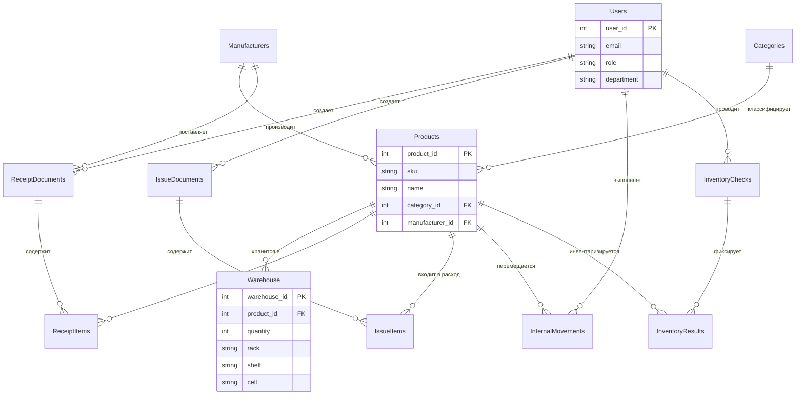

# 🏭 Автоматизированная система складского учёта (АСУ Склад)

**Разработчик:** Чуляков Семён Игоревич | **Группа:** 11/2-РПО-24/2 | **Дата актуализации:** 13.12.2025

---

## 📋 О проекте

Курсовой проект по дисциплине "Проектирование информационных систем". Цель — автоматизация полного цикла складских операций современного предприятия для ликвидации бумажного учёта, сокращения ошибок и повышения операционной эффективности.

**Ключевые цели:**
*   Сокращение времени на поиск товаров на складе на **60%**.
*   Уменьшение ошибок при инвентаризации на **90%**.
*   Повышение точности учёта товарно-материальных ценностей до **99,5%**.

## 🗂️ Структура проекта
``warehouse-management-system/
├── 📁 database/ # Рабочие скрипты базы данных
│ ├── 01_Main_Schema.sql # Скрипт создания ВСЕХ таблиц БД
│ ├── 02_Test_Data.sql # Скрипт с реалистичными тестовыми данными
│ ├── 03_Views_Procedures.sql # Представления, процедуры, функции, триггеры
│ └── Tables_Description.md # Подробное описание всех таблиц и связей
├── 📁 docs/ # Полная проектная документация
│ ├── 01_Technical_Specification.md # Техническое задание (ТЗ) по ГОСТ
│ ├── 02_Architecture_Design.md # Архитектура системы
│ ├── 03_Business_Process_Analysis.md # Анализ бизнес-процессов (AS-IS/TO-BE)
│ └── 04_UML_Diagrams.md # Диаграммы UML (Use Case, Sequence и др.)
├── 📁 diagrams/ # Папка для визуальных схем (ER-диаграмма и др.)
├── 📁 src/ # Исходный код будущего приложения (зарезервировано)
└── 📄 README.md # Этот файл``

## 🗃️ Модель данных (Основные таблицы)

Система построена на реляционной базе данных **Microsoft SQL Server** и включает следующие ключевые сущности:
*   **`Users`** – Пользователи (Администратор, Менеджер, Кладовщик, Аудитор).
*   **`Products`** – Номенклатура товаров с характеристиками.
*   **`Warehouse`** – Остатки товаров с привязкой к ячейкам (стеллаж/полка/ячейка).
*   **`ReceiptDocuments` / `IssueDocuments`** – Приходные и расходные накладные.
*   **`InternalMovements`** – Журнал внутренних перемещений.
*   **`InventoryChecks`** – Планы и результаты инвентаризаций.

> Полное описание: [`Tables_Description.md`](./database/Tables_Description.md)

## 🚀 Быстрый старт для проверки БД

1.  **Подготовка среды**: Убедитесь, что у вас установлен **Microsoft SQL Server** и **SQL Server Management Studio (SSMS)**.
2.  **Создание базы**: В SSMS выполните команду `CREATE DATABASE WarehouseManagement;`.
3.  **Загрузка структуры**: Выполните скрипт [`database/01_Main_Schema.sql`](./database/01_Main_Schema.sql) в контексте новой БД.
4.  **Наполнение данными**: Выполните скрипт [`database/02_Test_Data.sql`](./database/02_Test_Data.sql).
5.  **Проверка работы**:
    ```sql
    -- Просмотр текущих остатков
    SELECT * FROM vw_CurrentStock;
    -- Просмотр товаров для дозаказа
    SELECT * FROM vw_NeedToOrder;
    -- Тестирование процедуры приёмки
    EXEC sp_AddToStock @product_id=1, @quantity=5, @rack='A', @shelf='01', @cell='04';
    ```

## 📚 Полная документация

Вся проектная документация доступна в папке [`docs/`](./docs):
*   [Техническое задание (ТЗ)](./docs/01_Technical_Specification.md)
*   [Архитектурное описание](./docs/02_Architecture_Design.md)
*   [Анализ бизнес-процессов](./docs/03_Business_Process_Analysis.md)
*   [Диаграммы UML](./docs/04_UML_Diagrams.md)

## 🛠 Технологический стек (запланирован)

*   **Backend:** ASP.NET Core Web API (C#)
*   **Frontend:** React.js / Vue.js
*   **База данных:** Microsoft SQL Server
*   **Инструменты:** Git, GitHub, SSMS, Draw.io

---
## 🔗 ER-диаграмма базы данных (схема связей)



**© 2025 | Учебный проект. Все материалы подготовлены в рамках курсовой работы.**
