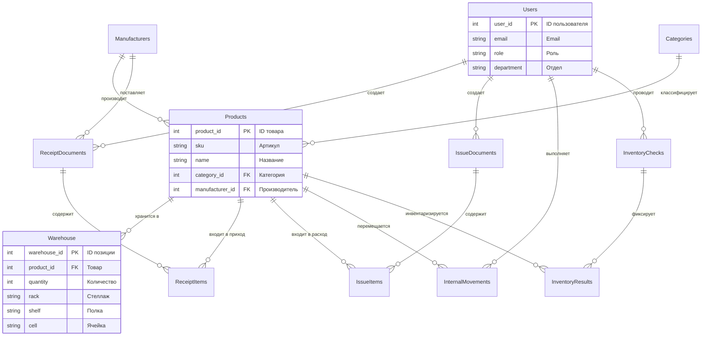

# 🏭 Автоматизированная система складского учёта (АСУ Склад)

**Разработчик:** Чуляков Семён Игоревич | **Группа:** 11/2-РПО-24/2 | **Дата актуализации:** 13.12.2025

---

## 📋 О проекте

Курсовой проект по дисциплине **«Проектирование информационных систем»**.  
**Цель** — автоматизация полного цикла складских операций современного предприятия для ликвидации бумажного учёта, сокращения ошибок и повышения операционной эффективности.

**Ключевые цели:**
*   Сокращение времени на поиск товаров на складе на **60%**.
*   Уменьшение ошибок при инвентаризации на **90%**.
*   Повышение точности учёта товарно-материальных ценностей до **99,5%**.

## 🏗️ Архитектура системы

**3.1. Общая архитектурная схема (планируемая)**
Система строится на основе **многоуровневой (N-слойной) архитектуры**:
1.  **Уровень представления (Presentation):** Веб-интерфейс (React) и/или мобильное приложение.
2.  **Уровень бизнес-логики (Business Logic):** Серверное приложение (ASP.NET Core Web API), реализующее все операции склада.
3.  **Уровень данных (Data Access):** Репозитории и ORM (Entity Framework Core) для работы с БД.
4.  **Уровень хранения данных (Data Storage):** Реляционная база данных **Microsoft SQL Server**.

**Выбор монолитной (многоуровневой) архитектуры** для учебного проекта обоснован:
*   **Простота разработки и развёртывания.**
*   **Целостность данных и транзакций** (операции приёмки/списания должны быть атомарными).
*   **Полный контроль над всеми компонентами системы.**

**3.2. Схема базы данных (ER-диаграмма)**
Основу системы составляет реляционная БД, спроектированная в **Microsoft SQL Server**.


**Ключевые сущности:**
*   **`Users`** – Пользователи системы (Администратор, Менеджер, Кладовщик, Аудитор).
*   **`Products`** – Номенклатура товаров.
*   **`Warehouse`** – Остатки товаров с привязкой к ячейкам хранения.
*   **`ReceiptDocuments` / `IssueDocuments`** – Приходные и расходные накладные.
*   **`InventoryChecks`** – Планы и результаты инвентаризаций.

Полное описание таблиц: [`Tables_Description.md`](./database/Tables_Description.md)

**4.1. Процесс оформления приёмки товара (пример бизнес-процесса)**
1.  **Создание документа:** Кладовщик создаёт приходную накладную на основе поступивших товаров.
2.  **Валидация и размещение:** Система проверяет корректность данных. Товар привязывается к конкретной ячейке (стеллаж/полка).
3.  **Подтверждение и обновление остатков:** После физической приёмки ответственный подтверждает операцию, остатки на складе автоматически увеличиваются.

## 🗂️ Структура проекта

```
warehouse-management-system/
├── 📁 database/ # Рабочие скрипты базы данных
│ ├── 01_Main_Schema.sql # Скрипт создания ВСЕХ таблиц БД
│ ├── 02_Test_Data.sql # Скрипт с реалистичными тестовыми данными
│ ├── 03_Views_Procedures.sql # Представления, процедуры, функции, триггеры
│ └── Tables_Description.md # Подробное описание всех таблиц и связей
├── 📁 docs/ # Полная проектная документация
│ ├── 01_Technical_Specification.md # Техническое задание (ТЗ) по ГОСТ
│ ├── 02_Architecture_Design.md # Архитектура системы (этот документ)
│ ├── 03_Business_Process_Analysis.md # Анализ бизнес-процессов (AS-IS/TO-BE)
│ └── 04_UML_Diagrams.md # Диаграммы UML (Use Case, Sequence, State)
├── 📁 diagrams/ # Папка для визуальных схем
│ └── ER_Diagram.png # ER-диаграмма базы данных
├── 📁 src/ # Исходный код будущего приложения (зарезервировано)
└── 📄 README.md # Этот файл
```
## 🔗 ER-диаграмма базы данных (схема связей)


```mermaid
erDiagram
    Users {
        int user_id PK "ID пользователя"
        string email "Email"
        string role "Роль"
        string department "Отдел"
    }
    
    Products {
        int product_id PK "ID товара"
        string sku "Артикул"
        string name "Название"
        int category_id FK "Категория"
        int manufacturer_id FK "Производитель"
    }
    
    Warehouse {
        int warehouse_id PK "ID позиции"
        int product_id FK "Товар"
        int quantity "Количество"
        string rack "Стеллаж"
        string shelf "Полка"
        string cell "Ячейка"
    }

    Users ||--o{ ReceiptDocuments : "создает"
    Users ||--o{ IssueDocuments : "создает"
    Users ||--o{ InternalMovements : "выполняет"
    Users ||--o{ InventoryChecks : "проводит"

    Manufacturers ||--o{ Products : "производит"
    Categories ||--o{ Products : "классифицирует"
    Manufacturers ||--o{ ReceiptDocuments : "поставляет"

    Products ||--o{ Warehouse : "хранится в"
    Products ||--o{ ReceiptItems : "входит в приход"
    Products ||--o{ IssueItems : "входит в расход"
    Products ||--o{ InternalMovements : "перемещается"
    Products ||--o{ InventoryResults : "инвентаризируется"

    ReceiptDocuments ||--o{ ReceiptItems : "содержит"
    IssueDocuments ||--o{ IssueItems : "содержит"
    InventoryChecks ||--o{ InventoryResults : "фиксирует"
```

# 🛠️ Технологический стек (планируемый)
*   **Backend:** ASP.NET Core Web API (C#)
*   **Frontend:** React.js / Vue.js
*   **База данных:** Microsoft SQL Server
*   **ORM:** Entity Framework Core
*   **Архитектура:** Многоуровневая (N-Layer)
*   **Инструменты:** Git, GitHub, SSMS, Draw.io

## 🚀 Быстрый старт для проверки БД
1.  **Подготовка среды:** Убедитесь, что установлен **Microsoft SQL Server** и **SQL Server Management Studio (SSMS)**.
2.  **Создание базы:** В SSMS выполните: `CREATE DATABASE WarehouseManagement;`.
3.  **Загрузка структуры:** Выполните скрипт [`database/01_Main_Schema.sql`](./database/01_Main_Schema.sql).
4.  **Наполнение данными:** Выполните скрипт [`database/02_Test_Data.sql`](./database/02_Test_Data.sql).
5.  **Проверка работы:**
    ```sql
    -- Просмотр текущих остатков
    SELECT * FROM vw_CurrentStock;
    -- Просмотр товаров для дозаказа
    SELECT * FROM vw_NeedToOrder;
    -- Тестирование процедуры приёмки
    EXEC sp_AddToStock @product_id=1, @quantity=5, @rack='A', @shelf='01', @cell='04';
    ```

## 📚 Документация
Вся проектная документация доступна в папке [`docs/`](./docs):
*   [Техническое задание (ТЗ)](./docs/01_Technical_Specification.md)
*   [Архитектура системы](./docs/02_Architecture_Design.md)
*   [Анализ бизнес-процессов (AS-IS/TO-BE)](./docs/03_Business_Process_Analysis.md)
*   [Диаграммы UML](./docs/04_UML_Diagrams.md)

---
**© 2025 | Учебный проект. Все материалы подготовлены в рамках курсовой работы.**
