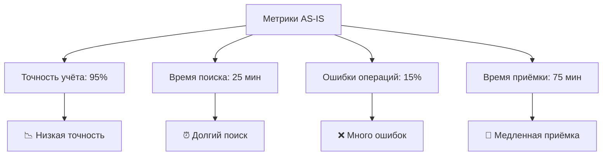
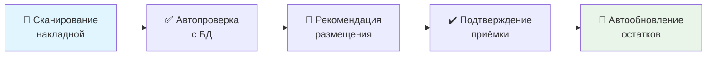
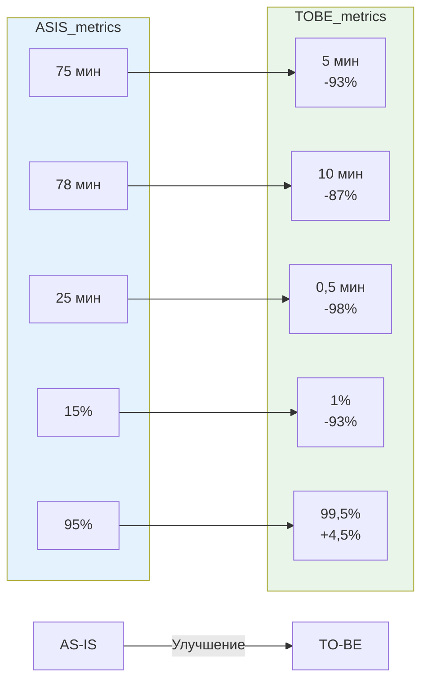

# Анализ бизнес-процессов системы складского учёта

**Разработчик:** Чуляков Семён Игоревич  
**Группа:** 11/2-РПО-24/2  
**Дата:** 13.12.2025

---

## 1. Введение

Документ описывает анализ текущих процессов складского учёта (AS-IS) и целевую модель (TO-BE) после внедрения автоматизированной системы.

**Цель:** Выявление проблемных зон и обоснование автоматизации.

## 2. Текущее состояние (AS-IS)

### 2.1. Ключевые бизнес-процессы и их характеристики

| Процесс | Основные этапы | Среднее время | Ключевые проблемы |
|---------|---------------|---------------|-------------------|
| **Приёмка товара** | 1. Получение бумажной накладной<br>2. Ручной поиск в журналах<br>3. Сверка и размещение<br>4. Запись в журнал | 75 минут | • Нет информации о свободных местах<br>• Ошибки при ручном внесении<br>• Длительный поиск товара в журналах |
| **Отпуск товара** | 1. Получение бумажной заявки<br>2. Поиск в журналах и на складе<br>3. Физический поиск товара<br>4. Списание в журнале | 78 минут | • 60% времени — физический поиск<br>• Риск двойного списания<br>• Нет контроля остатков в реальном времени |
| **Инвентаризация** | 1. Подготовка ведомостей<br>2. Обход и подсчёт<br>3. Сверка с журналами<br>4. Корректировка | 3-5 дней | • Остановка основных операций<br>• 12-15% ошибок<br>• Длительная сверка |

### 2.2. Сводные метрики AS-IS



## 3. Целевое состояние (TO-BE)

### 3.1. Оптимизированные процессы после внедрения АСУ

#### 3.1.1. Приёмка товара (TO-BE) — процесс



**Улучшения:**
- **Время:** 75 мин → 5 мин (‑93%)
- **Точность:** Автоматическая сверка данных
- **Контроль:** Отслеживание мест размещения в реальном времени

#### 3.1.2. Отпуск товара (TO-BE) — процесс


**Улучшения:**
- **Время:** 78 мин → 10 мин (‑87%)
- **Поиск:** Исключён физический поиск
- **Контроль:** Сканирование на каждом этапе

### 3.2. Сравнительная таблица AS-IS vs TO-BE

| Показатель | AS-IS | TO-BE | Улучшение |
|------------|-------|-------|-----------|
| **Время приёмки товара** | 75 минут | 5 минут | **‑93%** |
| **Время отпуска товара** | 78 минут | 10 минут | **‑87%** |
| **Поиск товара на складе** | 25 минут | 0,5 минут | **‑98%** |
| **Ошибки при инвентаризации** | 15% | 1% | **‑93%** |
| **Точность учёта остатков** | 95% | 99,5% | **+4,5%** |

### 3.3. Визуализация улучшений



**Легенда:**
- 🔵 **Синий столбец:** AS-IS (текущее состояние)
- 🟢 **Зелёный столбец:** TO-BE (целевое состояние)

---

### 3.4. Реальные примеры из разработанной системы

#### Пример 1: Приёмка товара в АСУ "Склад"

```sql
-- Создание приходной накладной (из вашего скрипта Демонстрация запросов.sql)
INSERT INTO ReceiptDocuments (document_number, supplier_id, receipt_date, total_amount, created_by) 
VALUES ('ПН-2025-001', 1, '2025-12-13', 15000.00, 1);

-- Размещение товара на складе
UPDATE Warehouse SET quantity = quantity + 50 
WHERE product_id = 1 AND rack = 'A' AND shelf = '01' AND cell = '01';
```

#### Пример 2: Проведение инвентаризации

```sql
-- Создание плана инвентаризации
INSERT INTO InventoryChecks (inventory_number, start_date, responsible_user) 
VALUES ('ИНВ-2025-12-001', '2025-12-13', 2);

-- Внесение результатов проверки
INSERT INTO InventoryResults (inventory_id, product_id, rack, shelf, cell, system_quantity, actual_quantity, checked_by) 
VALUES (1, 1, 'A', '01', '01', 50, 48, 1);
```

## 4. Связь с реальной базой данных

### 4.1. Как процессы реализованы в таблицах БД

| Бизнес-процесс | Таблицы БД | Описание реализации |
|----------------|------------|---------------------|
| **Приёмка товара** | `ReceiptDocuments`, `ReceiptItems`, `Warehouse` | Создание документа → добавление позиций → обновление остатков |
| **Отпуск товара** | `IssueDocuments`, `IssueItems`, `Warehouse` | Создание расхода → проверка остатков → списание |
| **Инвентаризация** | `InventoryChecks`, `InventoryResults` | План проверки → внесение результатов → анализ расхождений |
| **Управление товарами** | `Products`, `Categories`, `Manufacturers` | Ведение справочников, категоризация |
| **Внутренние перемещения** | `InternalMovements`, `Warehouse` | Регистрация перемещения → обновление ячеек хранения |
| **Управление пользователями** | `Users` | Аутентификация, роли, права доступа |

### 4.2. Проверка эффективности через SQL-запросы

```sql
-- Анализ времени операций (пример)
SELECT 
    'Приёмка' as операция,
    AVG(DATEDIFF(MINUTE, created_at, completed_at)) as среднее_время_мин
FROM ReceiptDocuments 
WHERE status = 'completed'

UNION ALL

SELECT 
    'Отпуск',
    AVG(DATEDIFF(MINUTE, created_at, completed_at))
FROM IssueDocuments 
WHERE status = 'completed';
```


