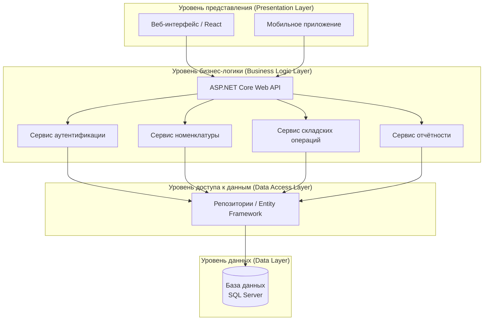
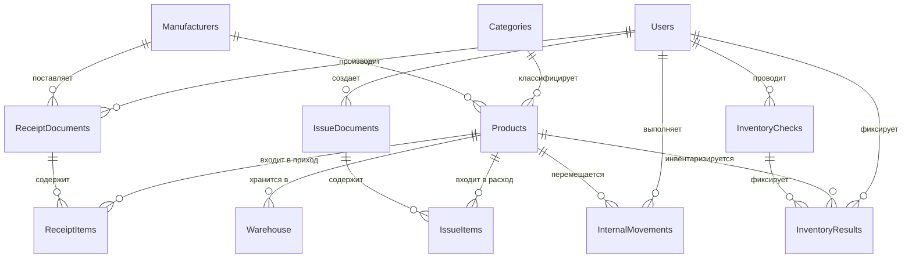
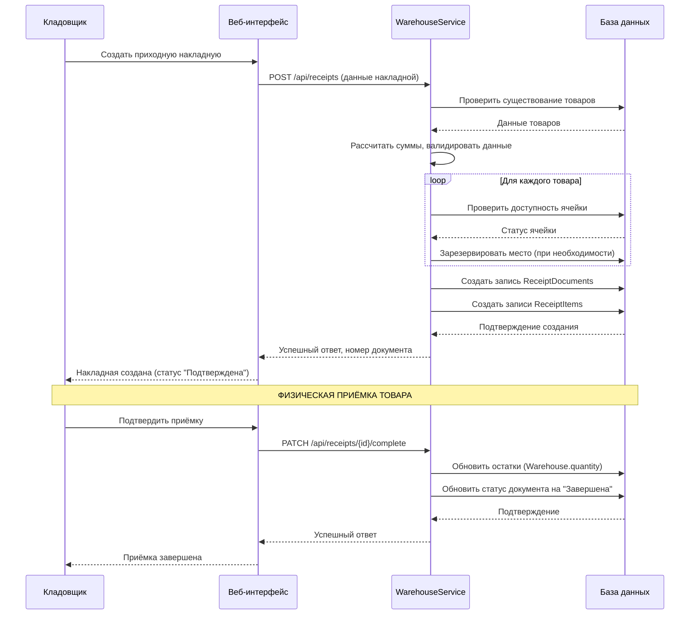

# Практическая работа
## «Проектирование архитектуры системы складского учёта»

**Студент:** Чуляков Семён Игоревич  
**Группа:** 11/2-РПО-24/2  
**Дата:** 13.12.2025

**Соответствие стандартам:** Архитектура разработана в соответствии с процессами жизненного цикла ПО (ГОСТ Р ИСО/МЭК 12207).

---

### 1. ОБОСНОВАНИЕ ВЫБОРА МНОГОУРОВНЕВОЙ АРХИТЕКТУРЫ

Для учебного проекта выбрана **многоуровневая архитектура** вместо микросервисной по следующим причинам:

| Критерий | Многоуровневая архитектура | Микросервисная архитектура | Обоснование выбора |
|----------|----------------------------|----------------------------|-------------------|
| **Сложность разработки** | Низкая/средняя | Высокая | Учебный проект, ограниченные сроки |
| **Целостность транзакций** | Высокая (ACID) | Сложная (Saga pattern) | Критично для операций приёмки/списания |
| **Развёртывание** | Простое (один пакет) | Сложное (оркестрация) | Отсутствие DevOps-инфраструктуры |
| **Производительность** | Высокая (внутрипроцессное взаимодействие) | Ниже (сетевое взаимодействие) | Необходима высокая скорость операций |
| **Поддержка** | Простая | Сложная | Проект будет поддерживаться одним разработчиком |

**Вывод:** Для системы складского учёта с требованиями к целостности данных и простотой разработки **многоуровневая архитектура является оптимальным выбором**.

---

### 2. ДЕТАЛЬНОЕ ОПИСАНИЕ КОМПОНЕНТОВ СИСТЕМЫ

#### 2.1. Уровень представления (Presentation Layer)
**Назначение:** Взаимодействие с пользователем, отображение данных, приём команд.

**Технологии:** React.js (SPA) или WPF (Desktop приложение на C#).

**Компоненты:**
1. **Модуль аутентификации:** Форма входа, восстановление пароля.
2. **Модуль номенклатуры:** Интерфейс для работы со справочником товаров.
3. **Модуль документов:** Создание/просмотр приходных, расходных накладных.
4. **Модуль склада:** Просмотр остатков, поиск по ячейкам, перемещения.
5. **Модуль отчётов:** Формирование и экспорт отчётов.

#### 2.2. Уровень бизнес-логики (Business Logic Layer)
**Назначение:** Реализация бизнес-правил, валидация, обработка операций.

**Технологии:** ASP.NET Core Web API (C#).

**Сервисы:**
1. **Сервис аутентификации и авторизации (AuthService):**
   - Аутентификация пользователей (JWT токены).
   - Управление ролями и правами доступа.
   - Ведение журнала аудита.

2. **Сервис номенклатуры (ProductService):**
   - Управление справочником товаров, категорий, производителей.
   - Валидация данных (уникальность артикула и т.д.).

3. **Сервис складских операций (WarehouseService):**
   - Обработка приёмки товара (создание `ReceiptDocuments`, обновление `Warehouse`).
   - Обработка списания (проверка остатков, создание `IssueDocuments`).
   - Управление внутренними перемещениями (`InternalMovements`).
   - Проведение инвентаризаций (`InventoryChecks`, `InventoryResults`).

4. **Сервис отчётности (ReportService):**
   - Формирование отчётов по остаткам, движениям, срокам годности.
   - Экспорт в PDF, Excel.

#### 2.3. Уровень доступа к данным (Data Access Layer)
**Назначение:** Абстракция для работы с базой данных.

**Технологии:** Entity Framework Core (ORM), Dapper (для сложных запросов).

**Компоненты:**
1. **Реализация репозиториев (Repository Pattern):**
   - `IProductRepository`, `IWarehouseRepository`, `IDocumentRepository`.
   - Изоляция кода доступа к данным от бизнес-логики.

2. **Unit of Work:** Обеспечение целостности транзакций (например, приёмка товара должна обновить и документ, и остатки атомарно).

#### 2.4. Уровень данных (Data Layer) — **РЕАЛЬНАЯ СТРУКТУРА ВАШЕЙ БД**
**Назначение:** Хранение и управление данными.

**Технологии:** Microsoft SQL Server 2019/2022.

**База данных:** `WarehouseManagement` (реально создана, содержит 13 таблиц).

**Основные таблицы (согласно вашей схеме):**
| Тип таблиц | Названия таблиц | Описание |
|------------|----------------|----------|
| **Основные** | `Users`, `Products`, `Warehouse` | Пользователи, товары, остатки |
| **Документы прихода** | `ReceiptDocuments`, `ReceiptItems` | Приходные накладные |
| **Документы расхода** | `IssueDocuments`, `IssueItems` | Расходные накладные |
| **Операции** | `InternalMovements` | Внутренние перемещения |
| **Инвентаризация** | `InventoryChecks`, `InventoryResults` | Проверки остатков |
| **Справочники** | `Categories`, `Manufacturers` | Категории и производители |

**Полное описание таблиц доступно в файле:** [`database/Описание таблиц.md`](./database/Описание%20таблиц.md)

---

### 3. ДЕТАЛЬНЫЕ СХЕМЫ ВЗАИМОДЕЙСТВИЯ

#### 3.1. Полная архитектурная схема



**Пояснение к схеме:** Архитектура системы разделена на четыре чётких уровня, что обеспечивает слабую связанность компонентов и простоту поддержки. Все запросы от клиентов проходят через единый API, который делегирует выполнение соответствующим сервисам.

#### 3.2. Схема базы данных (ER-диаграмма)



*Ссылка на актуальную ER-диаграмму: [`database/Общая схема.sql`](./database/Общая%20схема.sql)

**Ключевые связи:**
- `Users` → `ReceiptDocuments`, `IssueDocuments` (пользователь создаёт документы)
- `Products` → `Warehouse` (товар хранится в конкретных ячейках)
- `ReceiptDocuments` → `ReceiptItems` (состав приходной накладной)
- `IssueDocuments` → `IssueItems` (состав расходной накладной)
- `Products` → `InventoryResults` (результаты инвентаризации по товарам)

### 4. ПРОЦЕССЫ И ПОСЛЕДОВАТЕЛЬНОСТИ

#### 4.1. Диаграмма процесса оформления приходной накладной



**Пояснение:** Процесс разделён на две фазы: создание документа (электронное) и физическая приёмка с обновлением остатков. Это соответствует реальной практике работы склада.

### 5. ТЕХНИЧЕСКИЕ ХАРАКТЕРИСТВИКИ

#### 5.1. Технологический стек
| Компонент | Технология | Версия | Обоснование выбора |
|-----------|------------|---------|-------------------|
| **Backend** | ASP.NET Core | 6.0/8.0 | Высокая производительность, кроссплатформенность, богатая экосистема |
| **Frontend** | React.js + TypeScript | 18.x | Современный UI, компонентный подход, большое сообщество |
| **База данных** | Microsoft SQL Server | 2019/2022 | Надёжность, транзакционная целостность, знакомство по учебной программе |
| **ORM** | Entity Framework Core | 7.0/8.0 | Удобная работа с БД, миграции, LINQ |
| **Аутентификация** | JWT (JSON Web Tokens) | - | Стандарт де-факто для REST API, stateless |
| **Контейнеризация** | Docker | 24.x | Единая среда разработки/развёртывания |

#### 5.2. API спецификация (пример основных endpoints)
```
/api/v1/
├── auth/
│   ├── POST   /login
│   ├── POST   /register
│   └── GET    /profile
├── products/
│   ├── GET    /              # Список товаров с фильтрацией
│   ├── POST   /              # Создать товар
│   ├── GET    /{id}          # Получить товар по ID
│   └── PUT    /{id}          # Обновить товар
├── warehouse/
│   ├── GET    /stock         # Остатки товаров
│   ├── GET    /cells/{id}    # Информация по ячейке
│   └── POST   /move          # Переместить товар
├── receipts/
│   ├── POST   /              # Создать приходную накладную
│   ├── GET    /{id}          # Получить накладную
│   └── PATCH  /{id}/complete # Завершить приёмку
└── reports/
    ├── GET    /stock         # Отчёт по остаткам
    └── GET    /movements     # Отчёт по движениям
```

#### 5.3. Требования к инфраструктуре (для развёртывания)
- **Сервер приложений:** Windows Server 2022 или Linux (Ubuntu 22.04)
- **Память:** 8 GB RAM минимум
- **Процессор:** 4 ядра
- **Диск:** 100 GB SSD (для БД и приложения)
- **Резервное копирование:** Ежедневное автоматическое

### 6. ОБЕСПЕЧЕНИЕ КАЧЕСТВА И БЕЗОПАСНОСТЬ

#### 6.1. Стратегия тестирования
1. **Модульные тесты (Unit Tests):** xUnit/NUnit для backend, Jest для frontend. Покрытие > 70% критической бизнес-логики.
2. **Интеграционные тесты:** TestContainers для тестирования взаимодействия с БД.
3. **End-to-End тесты:** Cypress для тестирования ключевых пользовательских сценариев.
4. **Нагрузочное тестирование:** k6 или JMeter для проверки производительности.

#### 6.2. Меры безопасности
- **HTTPS/TLS** для всех внешних соединений.
- **Валидация входных данных** на всех уровнях (UI, API, БД).
- **Защита от SQL-инъекций** через параметризованные запросы (EF Core).
- **Rate limiting** (ограничение запросов) на уровне API.
- **Регулярное обновление зависимостей** для устранения уязвимостей.

### 7. ЗАКЛЮЧЕНИЕ И ВЫВОДЫ

Предложенная **многоуровневая архитектура** для системы складского учёта позволяет:

1. **Обеспечить целостность данных** за счёт транзакционности на уровне БД.
2. **Упростить разработку и отладку** по сравнению с микросервисным подходом.
3. **Легко масштабироваться** вертикально (усиление сервера) при росте нагрузки.
4. **Минимизировать сложность развёртывания** — один пакет для backend, один для frontend.
5. **Соответствовать учебным целям** — демонстрирует применение современных, но не избыточно сложных технологий.

📁 База данных: [`database/Общая схема.sql`](./database/Общая%20схема.sql)

📋 Описание таблиц: [`database/Описание таблиц.md`](./database/Описание%20таблиц.md)

🔍 Демонстрационные запросы: [`database/Демонстрация запросов.sql`](./database/Демонстрация%20запросов.sql)

---
**Разработчик архитектуры:**  
Чуляков Семён Игоревич  
