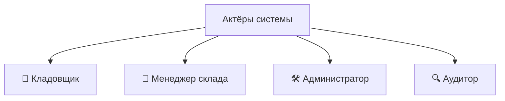
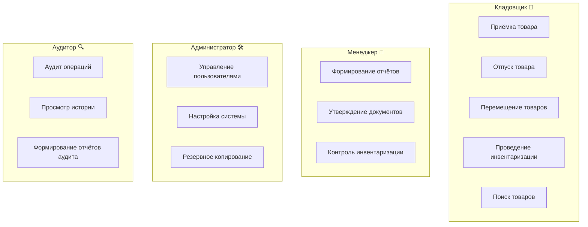
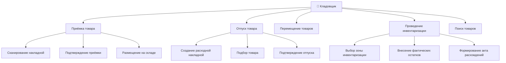
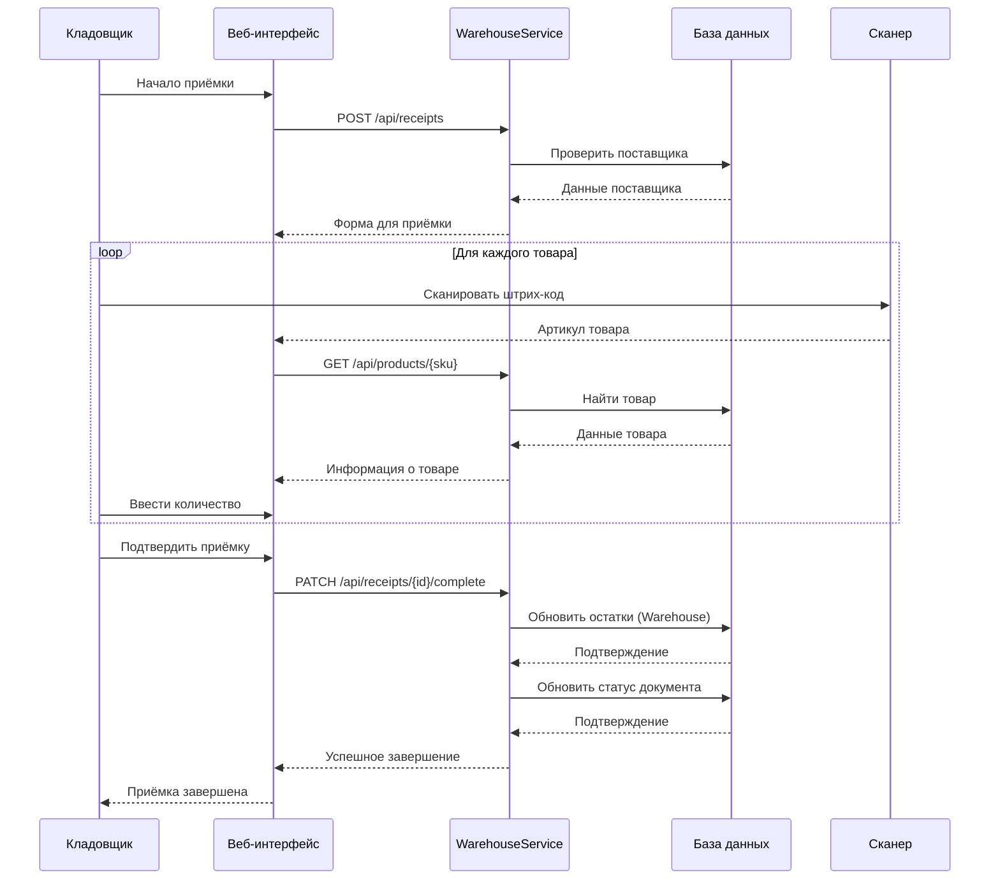
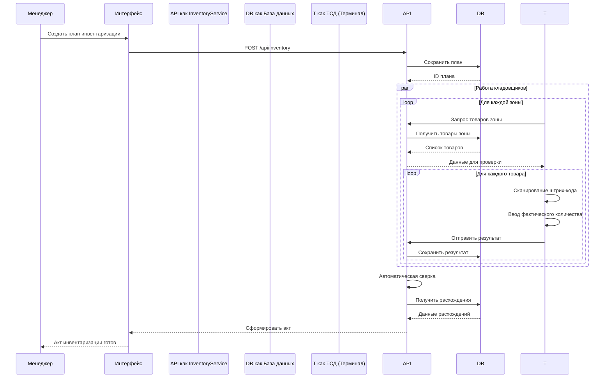
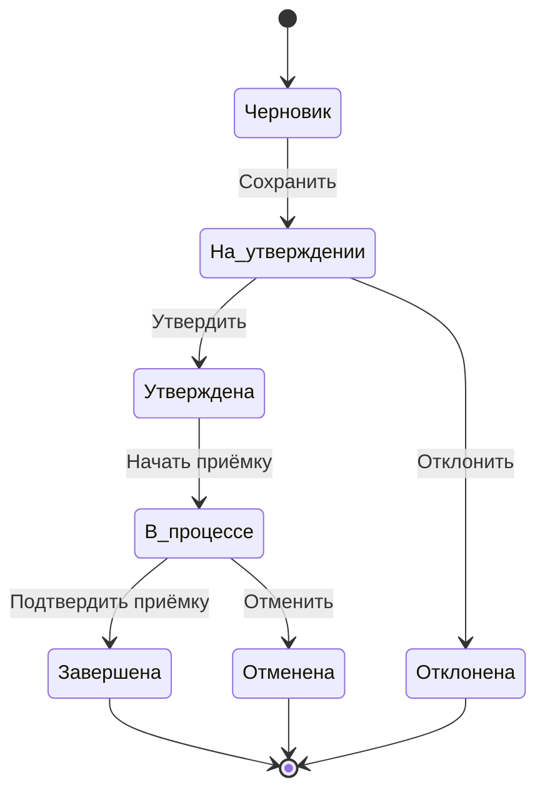
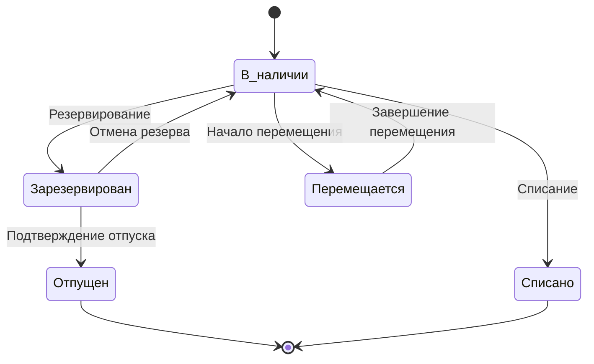
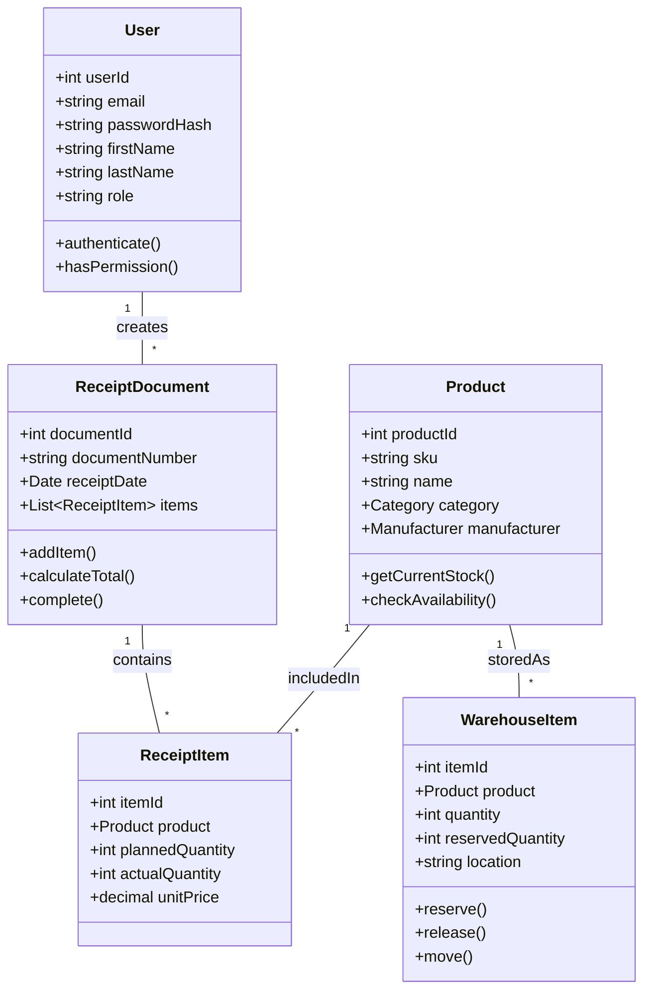
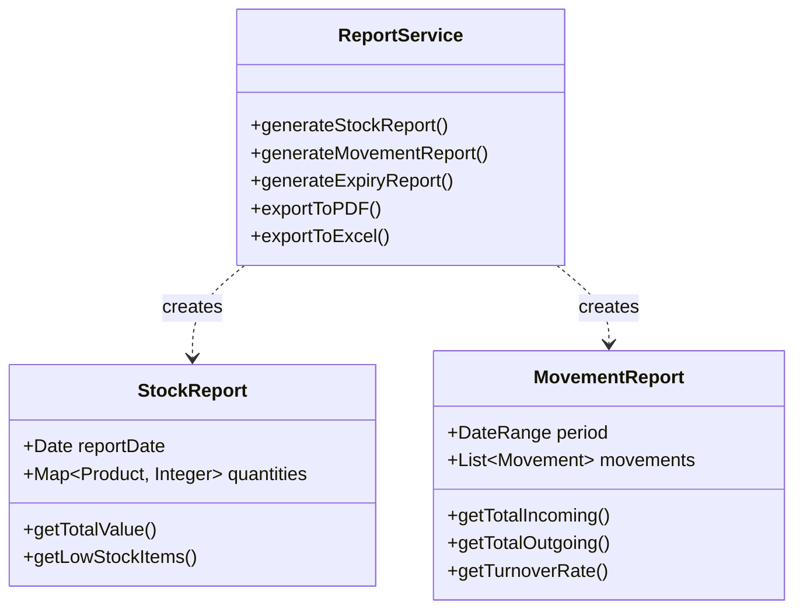
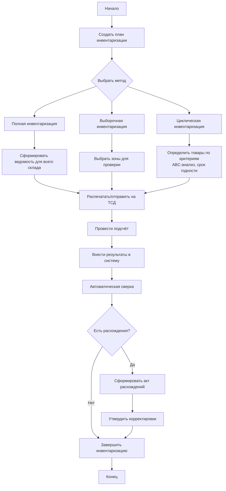

# UML-диаграммы системы складского учёта

**Разработчик:** Чуляков Семён Игоревич  
**Группа:** 11/2-РПО-24/2  
**Дата:** 13.12.2025

---

## 1. Диаграмма вариантов использования (Use Case Diagram)

### 1.1. Основные актёры системы

### 1.2. Варианты использования по ролям

### 1.3. Детальная диаграмма Use Case для Кладовщика

## 2. Диаграмма последовательности (Sequence Diagram)

### 2.1. Последовательность приёмки товара

### 2.2. Последовательность инвентаризации

## 3. Диаграмма состояний (State Diagram)

### 3.1. Состояния приходной накладной

### 3.2. Состояния товара на складе

## 4. Диаграмма классов (Class Diagram)

### 4.1. Основные классы системы

### 4.2. Классы для отчётности

## 5. Диаграмма активностей (Activity Diagram)

### 5.1. Процесс проведения инвентаризации

---

*Документ подготовлен в рамках курсового проекта по дисциплине «Проектирование информационных систем»*
